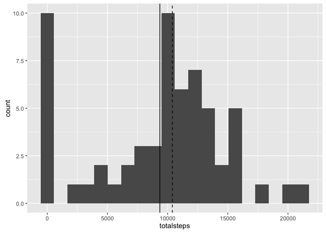
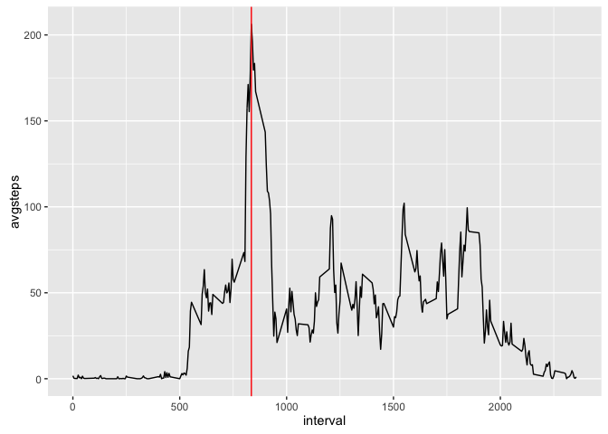
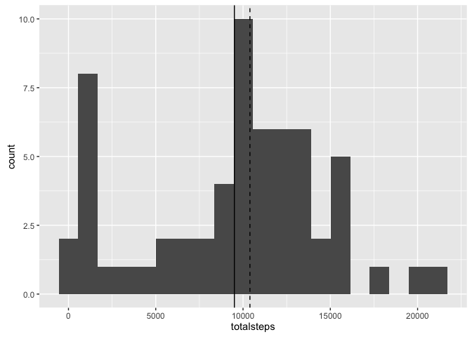
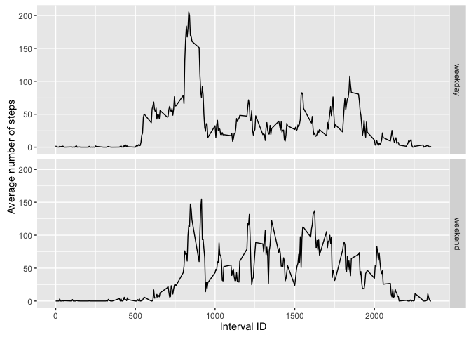

# Reproducible Research: Peer Assessment 1

## Used packages
For this report we need the following packages that are loaded via the following code.

```r
library(lubridate)
library(ggplot2)
library(dplyr)
```


## Loading and preprocessing the data
We begin by loading the data which consists of unzipping the data file and reading the csv file to the data.frame `raw_data` with already correct column classes.

```r
unzip("activity.zip", exdir = "reproducible-research-week2-data")
raw_data <- read.csv("reproducible-research-week2-data/activity.csv",
                     colClasses = c("numeric", "Date", "integer"))
```
As we are using the `dplyr` package and modify the data on the fly to the needs of the question addressed, no further preprocessing is required.


## What is mean total number of steps taken per day?
To answer that question we first are generating a history plot with the use of the `ggplot2` package.
In order to generate the plot we first group the `raw_data` by date and summarize by taking the sum.
This generates a new data.frame `steps_per_day` that has for each date the sum of all steps.
We can now easily plot a histogram of the total number of steps taken each day and also include the mean (solid line) and the median (dotted line) 

```r
steps_per_day <- raw_data %>% group_by(date) %>% summarize(totalsteps = sum(steps, na.rm = TRUE))
g <- ggplot(data = steps_per_day, aes(totalsteps))
g + geom_histogram(bins = 20) + geom_vline(xintercept = mean(steps_per_day$totalsteps)) +
    geom_vline(xintercept = median(steps_per_day$totalsteps), linetype=2)
```

<!-- -->

The mean is given by:

```r
mean(steps_per_day$totalsteps)
```

```
## [1] 9354.23
```
while the median is calculates as:

```r
median(steps_per_day$totalsteps)
```

```
## [1] 10395
```


## What is the average daily activity pattern?
The activity pattern can be seen in a timeseries plot.
For this we group the `raw_data` by intervals and summarize by taking the average.
The new data.frame is then used to generate the plot which also highlights the interval with the highest activity.

```r
average_steps_in_interval <- raw_data %>% group_by(interval) %>% summarize(avgsteps = mean(steps, na.rm = TRUE))
g <- ggplot(data = average_steps_in_interval, aes(interval, avgsteps))
g + geom_line() + geom_vline(xintercept = 835, color = "red")
```

<!-- -->

The interval with the highest average number of steps (the one that is highlighted in red in the plot) is the following:

```r
average_steps_in_interval %>% filter(avgsteps == max(avgsteps))
```

```
## # A tibble: 1 × 2
##   interval avgsteps
##      <int>    <dbl>
## 1      835 206.1698
```


## Imputing missing values
We see that there are a couple of rows with missing values for the activity.
The total number of rows is calculated like this:

```r
raw_data %>% filter(is.na(steps)) %>% count()
```

```
## # A tibble: 1 × 1
##       n
##   <int>
## 1  2304
```
In order to impute the 2304 rows with missing data we will calculate the medians of each interval and replace all missing values with the corresponding median of that specific interval.
Thus, the new data.frame `nona_data` has no longer missing data.

```r
nona_data <- raw_data
#using the median of the 5-minute interval
interval_medians <- raw_data %>% group_by(interval) %>% summarize(mediansteps = median(steps, na.rm = TRUE))
missing_intervals <- nona_data[is.na(nona_data$steps),]
replacement_data <- left_join(missing_intervals, interval_medians, by = c("interval"="interval"))
nona_data$steps[is.na(nona_data$steps)] <- replacement_data$mediansteps
```

The imputed data set yields a different histogram as can be seen in the following plot.

```r
steps_per_day_nona <- nona_data %>% group_by(date) %>% summarize(totalsteps = sum(steps, na.rm = TRUE))
g <- ggplot(data = steps_per_day_nona, aes(totalsteps))
g + geom_histogram(bins = 20) + geom_vline(xintercept = mean(steps_per_day_nona$totalsteps)) +
    geom_vline(xintercept = median(steps_per_day_nona$totalsteps), linetype=2)
```

<!-- -->

While the mean is changed by imputing the original data - as seen here:

```r
mean(steps_per_day_nona$totalsteps)
```

```
## [1] 9503.869
```
the median remains the same as before:

```r
median(steps_per_day_nona$totalsteps)
```

```
## [1] 10395
```


## Are there differences in activity patterns between weekdays and weekends?
In order to make a differentiation between weekdays and weekends, we establish a new factor variable `type_of_day` which indicatee whether the day of an observation is weekday or weekend.

```r
weekdays_distinguished <- nona_data %>% mutate(type_of_day = NA)
weekdays_distinguished[wday(weekdays_distinguished$date) %in% c(2,3,4,5,6), 4] <- "weekday"
weekdays_distinguished[wday(weekdays_distinguished$date) %in% c(1,7), 4] <- "weekend"
weekdays_distinguished$type_of_day <- as.factor(weekdays_distinguished$type_of_day)
```
In order to make the differences visible we plot the average number of steps for each interval differenciated by weekday and weekend.

```r
average_steps_in_interval <- weekdays_distinguished %>% group_by(type_of_day, interval) %>% summarize(avgsteps = mean(steps, na.rm = TRUE))
g <- ggplot(data = average_steps_in_interval, aes(interval, avgsteps))
g + geom_line() + facet_grid(type_of_day~.) + labs(x="Interval ID", y="Average number of steps")
```

<!-- -->
